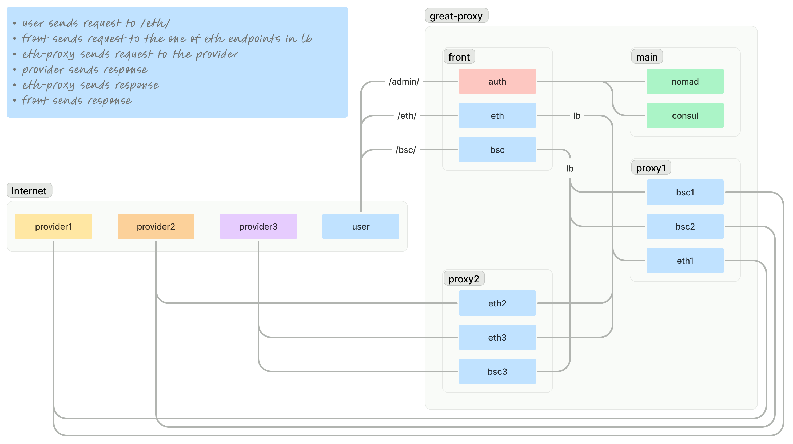

# Great Proxy WIP

Hello! This is a project that provides a single endpoint for a blockchain protocol (**ETH**, **BSC**, **BTC**, and others). Essentially, it's a proxy server that balances an unlimited number of third-party node providers (GetBlock, Infura, Alchemy, Quicknode, and others). It was designed with scalability in mind from the beginning: **it's easy to add a new provider**, and **it's easy to add a new protocol**. The following technologies were used for this: **Vagrant**, **Ansible**, **Consul**, **Nomad**, **Nomad-Pack**, **Envoy**.
